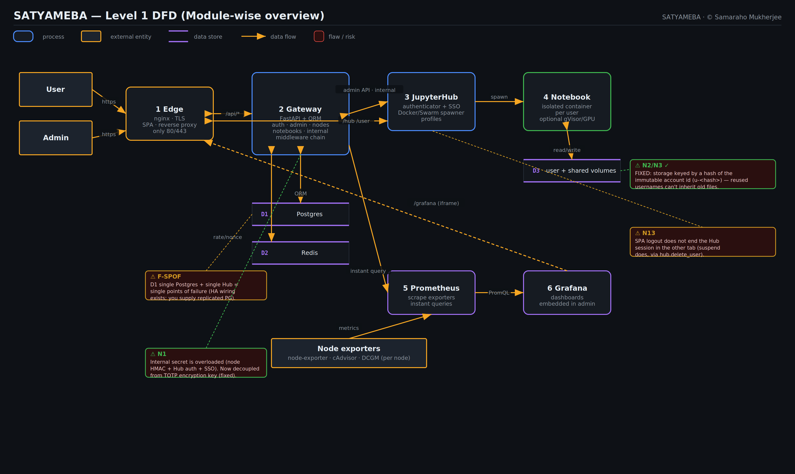

<div align="center">

# ◆ SATYAMEBA

**Your own private, multi-node Jupyter cloud — a Google-Colab-style notebook
platform that runs on your lab's own desktops.**

Register → an admin approves → log in → launch an **isolated** GPU notebook that
the cluster schedules onto a free machine. Fully dockerized, security-hardened,
plug-n-play.

*Owner & author: **Samaraho Mukherjee** · © 2026 · see [`OWNERSHIP.md`](OWNERSHIP.md)*

</div>

---

# 1 · Capabilities & Features

### 📓 Notebooks & workspace
- **Colab-like experience** — full JupyterLab in the browser: write/import
  notebooks, terminal, plots, file upload.
- **One-click launch with SSO** — pick a profile, click Launch, and JupyterLab
  opens in a new tab with **no second login**.
- **Resource profiles** — *Small (2 GB/1 CPU)*, *Medium (4 GB/2 CPU)*,
  *Large (8 GB/4 CPU)*, *GPU (8 GB/4 CPU/1 GPU)* — scheduling reserves to match.
- **No upload cap** — bring multi-GB datasets straight into your private `/work`.
- **Shared dataset volume** at `/home/jovyan/shared` for whole-lab data.
- **Your work follows you** — with NFS storage mode, files persist and reappear
  no matter which node you land on next. Logging out tears the notebook down;
  idle servers are auto-culled to free GPUs.
- **Private per-account storage** — each user's data lives in a folder with a
  **meaningless hashed name** (keyed to the immutable account id) and strict
  `0700` perms, so a re-used username can never inherit a deleted account's
  files. Encryption-at-rest is anchored by the owner keystore + crypto-erase
  (`owner-setup/`). With **`SAT_USER_ENCRYPTION=gocryptfs`** each user's data is
  stored as **on-disk ciphertext** (per-user keys derived from the owner KEK); a
  host-side agent mounts the decrypted view only into the running notebook, so a
  stolen/pulled disk is unreadable and the owner crypto-erase wipes everything
  instantly. (Set up with `setup/gocryptfs_setup.sh`; verify on real hardware.)

### 👑 Owner control & break-glass
- **Un-removable Owner role** (the project owner) — no admin can demote, suspend,
  or delete it, and nobody can self-promote to owner.
- **Out-of-band super-user tunnel** (`owner-setup/`) — Tailscale (WireGuard,
  outbound-only, **no router config**), SSO sign-in, reachable from anywhere; a
  separate control plane that survives a hostile co-admin.
- **Tamper response** — if the Owner account or the tunnel is stripped, the
  platform **seals** (halts + locks) and, when armed, **crypto-erases** all data
  after a grace window. Owner-triggered **panic** wipe too. *(See the honest
  cautions in [`owner-setup/README.md`](owner-setup/README.md).)*

### 👥 Users & administration
- **Approval-gated onboarding** — anyone can register, but an **admin must
  approve** before login. Reject spammers in a click.
- **Absolute admin control** — suspend/“kick off” a user (revokes their sessions
  and kills their notebook instantly), reinstate, grant admin, **reset 2FA /
  password, delete** — the Owner account excepted.
- **Admin dashboard** — pending approvals, all users, cluster nodes, live running
  sessions, monitoring, and a full audit log — in one place.
- **Appoint admins + create accounts from the web**, **invite codes** (auto-approve
  a class roster), **bulk** approve/suspend/delete, account **expiry**, per-user
  **GPU-hours quotas**, **tags/groups**, a **"needs attention"** panel, **broadcast
  announcements**, and a **maintenance mode** that pauses launches behind a banner.
- **Searchable activity logs (HTML tables)** — users see their own; admins see the
  total + per-user logs with live search + CSV export.
- **Tamper-evident audit log** — every privileged action is hash-chained and
  verifiable. **The owner is invisible** — owner activity is never recorded and the
  owner account is hidden from every admin listing.

### ⚖️ Cluster & GPU scheduling
- **Master + workers over Docker Swarm** — same-VLAN workers join with one token;
  **remote / off-VLAN nodes** join over a Tailscale tailnet (a separate wizard).
- **Dynamic GPU load balancing** — while the cluster is quiet every active user
  gets a **whole node** (full GPU/VRAM); once it fills, newcomers **share a node's
  GPU concurrently** (co-tenants are notified, newcomer queued for promotion). N
  is read live from the node list, so **adding nodes just works**.
- **Kaggle-style GPU boost** — request "more GPUs"; an admin approves; your next
  session spreads across every free GPU node (the whole cluster at 3 a.m.).
  `satyameba-ddp train.py` wraps `torchrun` for distributed training.
- **Maintainability** — admin **drain/maintenance mode** per node before a reboot;
  add nodes any time.
- **Storage-aware sizing** — a scan reads each host's disk/RAM/CPU and sizes the
  deployment to it.

### ✨ Beautiful UI & live resources
- **Neon JupyterLab theme** — animated cyan→magenta→violet gradient borders, glow,
  and a matching neon SPA.
- **Live resource widgets** — RAM/VRAM/GPU/CPU meters, a node-busy light and an
  **"N sharing"** indicator in both the workspace and an in-Lab **traffic strip**
  (with a "More GPUs" button).
- **In-app notifications** — sharing started, boost approved/denied, node freed.

### 🖥️ Headless & one-button setup
- **One-command whole-cluster wizard** (`setup/cluster_setup.sh`) — from the
  master it sets up **every PC** over SSH **as root** (asks once for your
  password), installs Docker + the NVIDIA toolkit where missing, **cross-checks a
  single CUDA/torch wheel** so non-RTX-5070 nodes integrate, sets up the
  un-removable owner on all nodes, joins the Swarm, and serves the site on
  **ports 80 & 443 only**. Idempotent, fully logged, fails safe.
- **All-in-one single-node installer** (`setup/install_wizard.sh`) — a real
  setup-program feel: input fields + a **live progress bar** (deps → driver/
  toolkit → backend → services → desktop-slim/TUI → verify → owner break-glass).
  Over SSH or console, **any resolution**, on **any distro**. `--unattended` / `--dry-run`.
- **Uninstall the desktop to save RAM** (reversible) and run a **neon curses
  dashboard** on the monitors showing per-node health + active users.
- **Boot services** — the whole stack starts on power-on via systemd; failproof.

### 📊 Monitoring
- **Prometheus + Grafana** — per-node CPU, GPU, network and storage (node-exporter
  + cAdvisor + NVIDIA DCGM).
- **Live numbers in the admin Overview**, pulled straight from Prometheus.

### 🔐 Security (full mapping in [`docs/SECURITY.md`](docs/SECURITY.md))
- **TLS-only edge** — only ports **80/443** are ever exposed; everything else is
  internal.
- **Strong auth** — bcrypt passwords, short-lived **RS256** JWTs with refresh
  rotation, **per-request HMAC signing** (replay + tamper protection), and
  **TOTP 2FA** (works fully offline — no third-party service).
- **Hardened isolation** — `cap_drop=ALL`, `no-new-privileges`, CPU/RAM caps,
  private volumes, no host mounts, plus an **optional gVisor sandbox runtime**.
- **OWASP-aware** — ORM-only DB (no SQLi), strict validation, rate limiting,
  security headers + **CSP**, bot filtering, forced rotation of the seeded admin
  password.

### 🧰 Operations
- **Everything dockerized** — backend, frontend, db, hub, monitoring, and the
  notebooks themselves. If it runs for us, it runs for you.
- **tkinter setup wizard** — checks/installs every dependency with progress bars
  and verifies GPU passthrough.
- **Backup & restore**, **HA path** (3-manager quorum + external Postgres),
  **Let's Encrypt** helper, and **cryptographically signed ownership**.
- **Tested** — committed gateway test suite + GitHub Actions CI.

> **Honest notes (also in [`docs/SECURITY.md`](docs/SECURITY.md)):** client-side
> JS obfuscation only slows casual snooping, and no token scheme can stop a user
> from proxying *their own* browser session — those are handled the only real way
> (server-side authz + short-lived signed/rotated tokens + replay protection).
> Some items need your infra: replicated Postgres, OIDC/LDAP, hard disk quotas,
> and on-hardware GPU/gVisor verification.

### Architecture at a glance
```
clients ──https(80/443)──▶ edge (nginx · TLS · SPA · reverse proxy)
                              ├─▶ gateway (FastAPI + SQLAlchemy)  ──▶ postgres + redis
                              ├─▶ jupyterhub ──spawns──▶ isolated notebook containers
                              └─▶ grafana ◀── prometheus ◀── node-exporter / cAdvisor / DCGM

MASTER (swarm manager) ──:2377──▶ WORKER 1 · WORKER 2 · WORKER 3 …  (same VLAN, NFS-shared)
```

**Data-flow diagrams** (Level 0/1/2) + a lifecycle flowchart, annotated with the
latest scan's findings, are in [`docs/diagrams/`](docs/diagrams/README.md):



Full rationale: [`docs/ARCHITECTURE.md`](docs/ARCHITECTURE.md).

---

# 2 · Setting up the nodes

**Prerequisites:** Debian on each box. The wizard installs the rest (Docker,
Compose, NVIDIA driver + Container Toolkit).

```bash
git clone <this-repo> SATYAMEBA && cd SATYAMEBA
sudo apt-get install -y python3-tk          # for the GUI wizard
sudo python3 setup/satyameba_setup.py
```

In the wizard: **Check dependencies → Install / fix missing → Verify GPU →
Scan storage & resources**, then **Bootstrap node**.

| Wizard button | What it does |
|---------------|--------------|
| **1 · Check dependencies** | Probes Docker, Compose v2, NVIDIA driver + toolkit, openssl, curl, git. |
| **2 · Install / fix missing** | Installs/repairs from the official Docker & NVIDIA apt repos. |
| **3 · Verify GPU passthrough** | Runs `docker run --gpus all … nvidia-smi` to prove containers see the GPU. |
| **Scan storage & resources** | Sizes per-user RAM/CPU/storage in `.env` to this host. |
| **Add me to docker group** | `usermod -aG docker $USER` (run docker without sudo). |
| **Bootstrap node ▶** | Runs the master or worker bootstrap with your chosen options. |

### Option A — one machine (quickest, ~5 min)
Pick **Master + “Single-host”** in the wizard, or headless:
```bash
./setup/master_init.sh --single --gpu
```
Open **https://localhost/**. The admin username/password are saved in `.env`
(`SAT_BOOTSTRAP_ADMIN_*`); the dashboard prompts you to change it on first login.

### Option B — the 4-desktop lab (multi-node)
**On the master** (enable `--nfs` so user work follows them across nodes):
```bash
./setup/master_init.sh --advertise-addr 192.168.1.10 --domain satyameba.local \
    --gpu --nfs --users 16
```
It inits the swarm, deploys the stack, and **prints a ready-to-paste worker
command**. **On each of the other 3 nodes:**
```bash
sudo ./setup/worker_join.sh \
    --master-ip 192.168.1.10 --join-token SWMTKN-1-xxxx \
    --node-secret <printed-secret> --gateway https://192.168.1.10 \
    --gpu --nfs-server 192.168.1.10
```
Each worker joins the swarm, builds the notebook image, mounts the NFS share,
and **registers itself** — it appears under **Admin → Nodes** as online. Add more
nodes by repeating the one command.

**Firewall (VLAN-only):** open `2377/tcp`, `7946/tcp+udp`, `4789/udp` between
nodes; expose only `80/443` to clients. Multi-node, HA, NFS, GPU, backups and TLS
details: [`docs/DEPLOYMENT.md`](docs/DEPLOYMENT.md).

---

# 3 · Using it

### As an admin
1. Log in at `https://<host>/` with the seeded admin; **change the password** when
   prompted, and optionally enable **2FA** (scan the QR in your workspace).
2. **Approvals** — approve or reject new sign-ups (grant *user* or *admin*).
3. **Users** — see everyone; **kick off** (suspend) a misbehaving user instantly,
   or reinstate.
4. **Nodes** — every machine, role, GPU, online status, heartbeat.
5. **Sessions** — who has a notebook running right now.
6. **Monitoring** — live CPU/GPU/network/storage per node (embedded Grafana +
   inline Prometheus numbers).
7. **Audit** — the tamper-evident log; verify its integrity in one click.

### As a user
1. **Register**, then wait for admin approval; log in once approved.
2. **Pick a profile** (Small/Medium/Large/GPU) and click **Launch** — JupyterLab
   opens in a new tab (SSO, no second login), placed on a free node.
3. **Upload datasets** (no size cap) into `/work`; use shared data in `/shared`.
4. Train/run on the lab's GPUs. Step away — your files persist; relaunch later and
   your work is right where you left it.
5. Optionally enable **2FA** and change your password from the workspace.

### 🎬 Animated walkthroughs
Step-by-step Manim videos for both audiences live in [`tutorial/`](tutorial/) —
an **admin setup** guide and a **user journey**, with the same flow told as
stories in [`tutorial/NARRATIVE.md`](tutorial/NARRATIVE.md).
```bash
pip install -r tutorial/requirements.txt && ./tutorial/render.sh
```

### Handy commands
```bash
make help          # list everything
make scan USERS=16 # size .env to this host's storage/RAM/CPU
make up            # build images (incl. notebook) + start single-host stack
make logs          # tail logs
make backup        # dump DB + secrets to backups/
make sign KEY="Samaraho Mukherjee <you@example.com>" TAG=v0.1.0
make verify        # verify integrity + ownership signature
```

---

## Reference

```
SATYAMEBA/
├── gateway/      FastAPI auth & orchestration API (ORM, JWT, 2FA, signing, audit)
├── frontend/     Vanilla-JS SPA + the nginx edge (TLS, reverse proxy, CSP)
├── jupyterhub/   Hub config, gateway-backed authenticator + SSO, hardened notebook image
├── monitoring/   Prometheus (compose + swarm) + Grafana provisioning & dashboard
├── setup/        tkinter wizard, master_init.sh, worker_join.sh
├── scripts/      secrets, resource scan, NFS, GPU runtime, gVisor, HA, backup, certs, signing
├── tutorial/     Manim animated guides (admin + user) + SVG art
├── docs/         ARCHITECTURE · SECURITY · DEPLOYMENT · CHARACTERISTICS · KNOWN_ISSUES
├── docker-compose.yml / .swarm.yml / .external-db.yml
└── OWNERSHIP.md · LICENSE · SHA256SUMS · Makefile
```

- **Capabilities, limits & every default:** [`docs/CHARACTERISTICS.md`](docs/CHARACTERISTICS.md)
- **Self-audited status / flaw log:** [`docs/KNOWN_ISSUES.md`](docs/KNOWN_ISSUES.md)
- **Ownership** belongs to **Samaraho Mukherjee** — verify provenance:
  ```bash
  ./scripts/verify_release.sh && gpg --verify SHA256SUMS.asc SHA256SUMS
  ```

<div align="center"><sub>SATYAMEBA · Colab on your own metal · © 2026 Samaraho Mukherjee</sub></div>
