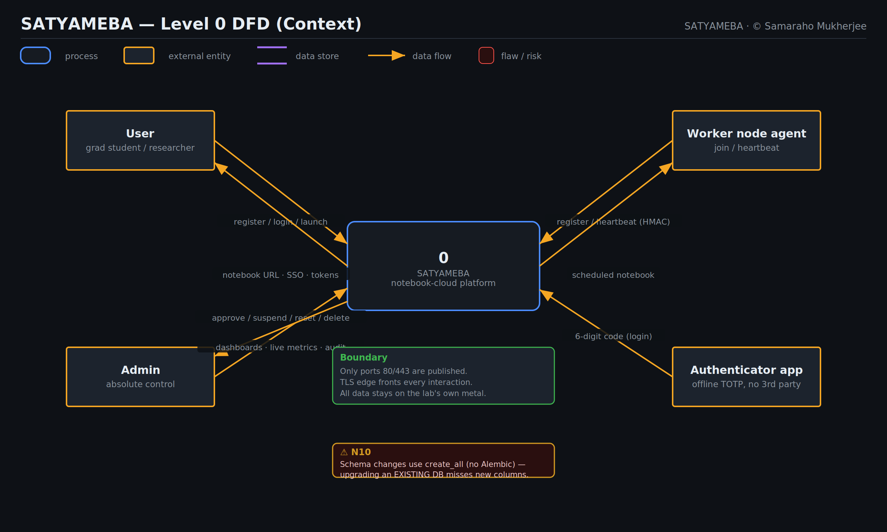
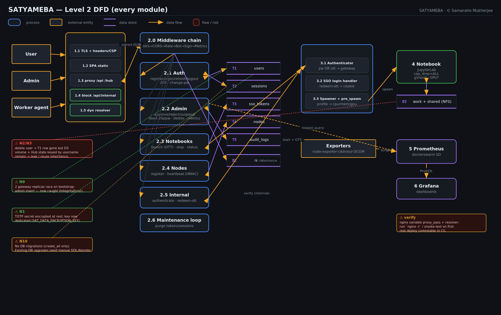
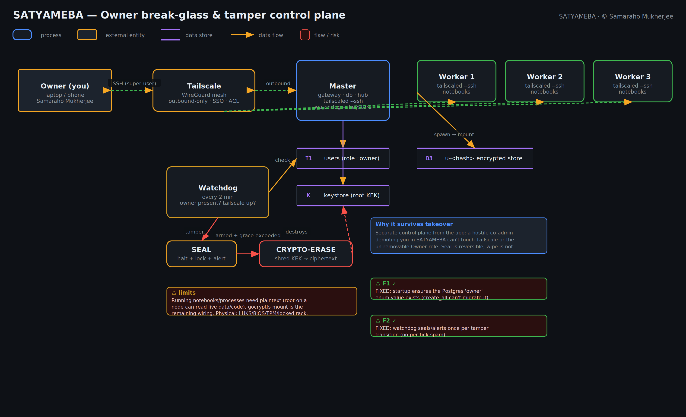
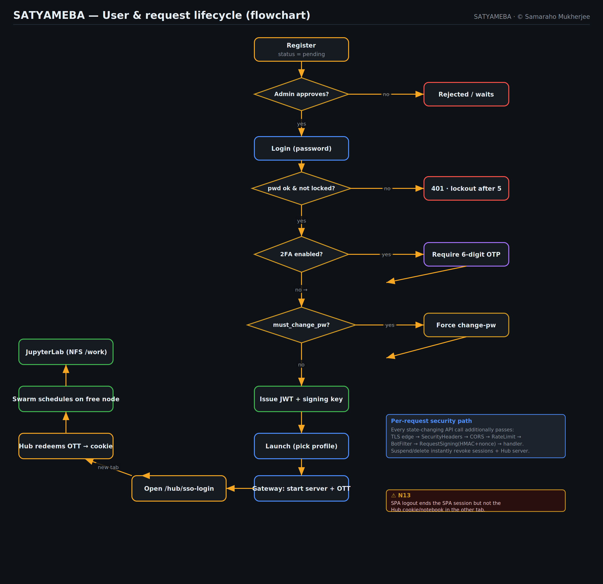

# SATYAMEBA — Data-Flow Diagrams & Second Integration Scan

Hand-generated DFDs (Level 0/1/2) and a lifecycle flowchart, with the findings
of a second, integration-focused scan annotated directly onto them (red = open
risk, green callout = already fixed, amber = verify/known).

Regenerate (SVG + PNG) with:

```bash
pip install cairosvg
python docs/diagrams/generate.py
```

## Level 0 — Context (total overview)


The whole platform as one process between four external entities — **User**,
**Admin**, **Worker-node agent**, and the **offline authenticator app**. Only
80/443 cross the boundary; everything stays on the lab's metal.

## Level 1 — Module-wise overview


Edge → Gateway → (Postgres / Redis) and Gateway ↔ JupyterHub → Notebook ↔
volumes, with Prometheus/Grafana fed by per-node exporters.

## Level 2 — Every module


The Gateway decomposed into its processes (middleware chain, auth, admin,
notebooks, nodes, internal, maintenance) and the Postgres tables they touch, plus
the Edge and Hub sub-processes.

## Owner break-glass & tamper control plane


The out-of-band owner control plane (Tailscale tunnel + un-removable Owner role +
tamper watchdog → seal → crypto-erase + keystore), separate from the app so a
hostile co-admin can't lock you out.

## Lifecycle flowchart


Register → approve → login → (2FA) → (forced password change) → token issue →
launch → SSO hand-off → Swarm placement → JupyterLab, with the per-request
security path called out.

---

## How it integrates (the reasoning behind the diagrams)

- The **edge** is the only public surface and now **blocks `/api/internal/*`**;
  the Hub reaches the gateway **internally** (`http://gateway:8000`), so that
  block doesn't break SSO/auth. Worker heartbeats use `/api/nodes/*` (not
  internal), so they still flow through the edge.
- The **gateway is the single source of truth** for identity; the Hub delegates
  every login (password or one-time SSO token) back to it, and only *approved*
  users spawn. The gateway holds the **only** Hub admin token.
- **One overloaded secret** (`SAT_INTERNAL_SHARED_SECRET`) signs node tokens, the
  SSO handshake, and the Hub↔gateway channel — TOTP-at-rest encryption is now
  **decoupled** onto its own `SAT_DATA_ENCRYPTION_KEY` so rotating the internal
  secret no longer locks 2FA users out.
- **Identity is keyed by username** end-to-end (Hub user, per-user volume, NFS
  dir, internal HMAC) — fine while the username is live, but it is the root of
  the deletion/reuse risk below.

## Second-scan findings (new)

| # | Finding | Severity | Status |
|---|---------|----------|--------|
| **N1** | `SAT_INTERNAL_SHARED_SECRET` overloaded; was also the TOTP encryption key. | 🟠 | ✅ Fixed — dedicated `SAT_DATA_ENCRYPTION_KEY`. |
| **N2/N3** | A re-registered same username could inherit a deleted user's files. | 🔴→✅ | **Fixed** — storage keyed by a hash of the immutable account id (`u-<hash>`). |
| **F1** | New `owner` enum value missing on **existing** Postgres DBs (create_all can't migrate). | 🔴→✅ | **Fixed** — startup `ALTER TYPE … ADD VALUE IF NOT EXISTS`. |
| **F2** | Watchdog re-sealed/alerted every 2-min tick (spam + repeated stack-down). | 🟠→✅ | **Fixed** — seal/alert once per tamper transition. |
| **N9** | Two gateway replicas race on first-run bootstrap-admin insert. | 🟡 | ✅ Fixed — `IntegrityError` is caught. |
| **N10** | Schema changes rely on `create_all`; **upgrading an existing DB misses new columns** (no Alembic). | 🟠 | 📌 Open — needs Alembic or documented manual DDL. |
| **N13** | SPA logout ends the SPA session but not the Hub cookie/notebook in the other tab (suspend/delete do). | 🟡 | 📌 Open — minor. |
| **N5** | nginx variable `proxy_pass` + dynamic resolver can't be CI-tested. | 🟡 | ⚠ Verify with `nginx -t` / smoke test on first real deploy. |
| **N16** | Rightmost-XFF assumes exactly one trusted proxy (the edge). | ⚪ | Assumption — documented; revisit if an external LB is added. |
| **N8** | Production fail-closed can crash-loop the gateway if secrets aren't mounted. | ⚪ | Intended (clear log); operators must mount secrets. |

### N2/N3 mitigations (recommended next)
1. **Namespace per-user storage by immutable user-id**, not username, so a reused
   name can never mount a prior user's volume (cleanest).
2. Or on delete, remove the per-user volume / NFS dir from the node that owns it
   (the gateway can't — only the Hub/host can — so this needs a Hub-side hook).
3. Interim: the delete action is audited; an admin should reclaim
   `satyameba-user-<name>` / `/srv/satyameba/users/<name>` manually, and avoid
   reusing usernames.
